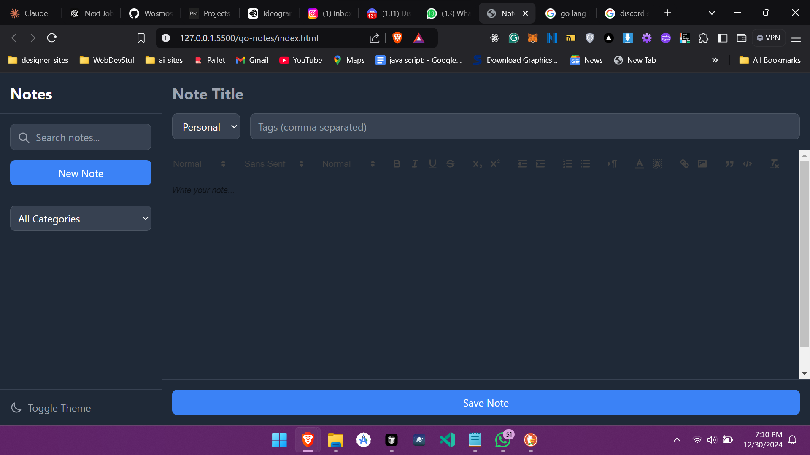
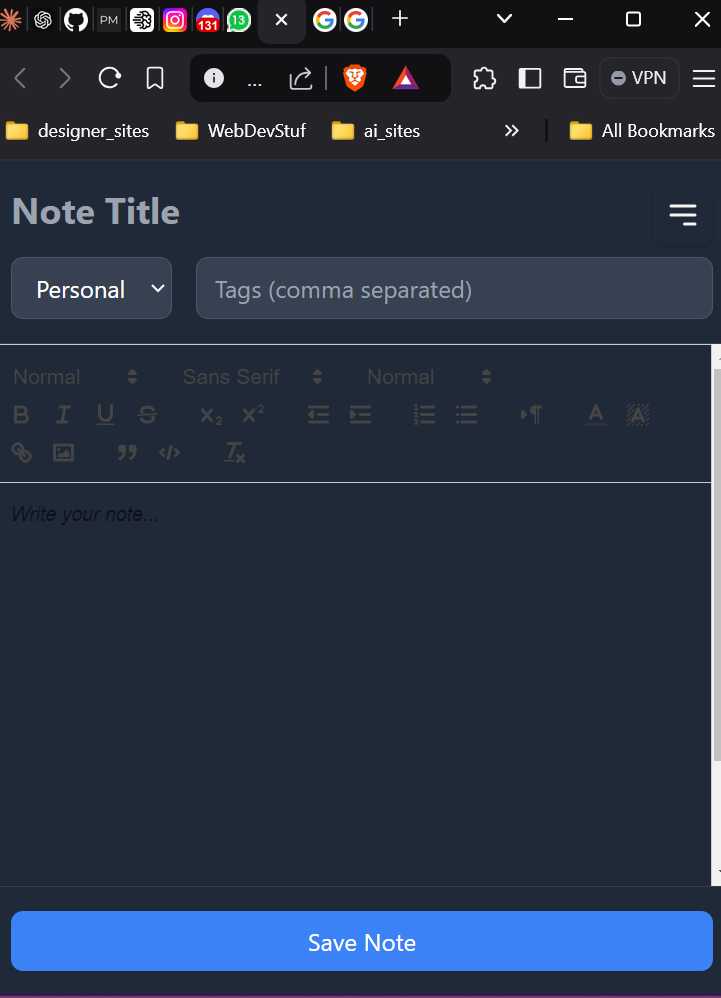

# Not Just Another Todo 


Welcome to **Not Just Another Todo**, a beautifully designed, iOS-inspired **Notes App** built with **HTML**, **Tailwind CSS**, **JavaScript**, and the powerhouse backend of **GoLang**! 🎉 This isn’t your average note-taking app; it’s a sleek, feature-packed, and fun application with a dash of productivity magic.

---

## 🚀 Features

### **1. Dark Neumorphism Design** 🌒

- A visually stunning, iOS-inspired interface with soft shadows and gradients.
- Fully responsive for all devices, ensuring your notes look gorgeous anywhere.

### **2. Rich Text Editor** 🖋️

- Powered by **Quill.js**, enjoy bold, italic, underlines, code blocks, headers, and even text colors to express yourself fully.
- Auto-save functionality ensures you never lose your creative sparks.

### **3. Advanced Search and Filters** 🔍

- Quickly search for notes with tags, categories, and full-text search.
- Filter notes by personal, work, or custom categories.

### **4. Pinning & Sorting** 📌

- Pin important notes to keep them on top.
- Sort notes by the latest edits or importance.

### **5. GoLang Backend** 🛠️

- Lightning-fast API built with **GoLang**, ensuring seamless performance.
- Handles CRUD operations with ease.

### **6. Custom Alerts and Animations** ✨

- Goodbye boring alerts! Enjoy beautifully animated modals for a polished UX.

---

## 📷 Preview Screenshots





---

## 🛠️ Tech Stack

| Frontend               | Backend         |
| ---------------------- | --------------- |
| **HTML5**              | **GoLang**      |
| **Tailwind CSS**       | **Gorilla Mux** |
| **Quill.js**           | **JSON as DB**  |
| **Vanilla JavaScript** |                 |

---

## 🌟 Key Highlights

### **Neumorphism Done Right**

Our app’s design draws inspiration from iOS’s modern, minimalist aesthetic. The subtle shadows, transitions, and smooth animations bring your notes to life.

### **Blazing Fast Go Backend** 🐹

The backend is powered by GoLang, making CRUD operations lightning-fast. The clean architecture and efficient routing with Gorilla Mux ensure scalability and robustness.

### **Custom Animations & Alerts**

Animations are not just eye candy—they guide the user experience. Our ripple effects and modal alerts provide tactile feedback with a professional touch.

---

## 🧑‍💻 Installation & Setup

### **1. Clone the Repository**

```bash
git clone https://github.com/yourusername/not-just-another-todo.git
cd not-just-another-todo
```

### **2. Frontend Setup**

Open the `index.html` file directly in your browser or serve it locally using:

```bash
npx live-server
```

### **3. Backend Setup**

#### Prerequisites:

- **GoLang** installed ([Download GoLang](https://golang.org/dl/)).
- Clone the backend in the `backend/` folder.

Run the following commands:

```bash
cd backend

go mod init notes-app

go run main.go
```

The backend server will start on `http://localhost:8080`.

---

## 📚 API Documentation

### **Base URL**: `http://localhost:8080/api`

### **1. Get All Notes**

```http
GET /notes
```

**Response**:

```json
[
  {
    "id": 1,
    "title": "My First Note",
    "content": "This is the content of the note.",
    "category": "personal",
    "tags": ["fun", "important"],
    "is_pinned": true,
    "updated_at": "2024-01-01T10:00:00Z"
  }
]
```

### **2. Create a Note**

```http
POST /notes
```

**Request Body**:

```json
{
  "title": "My First Note",
  "content": "This is the content of the note.",
  "category": "personal",
  "tags": ["fun", "important"],
  "is_pinned": true
}
```

### **3. Update a Note**

```http
PUT /notes/:id
```

### **4. Delete a Note**

```http
DELETE /notes/:id
```

---

## 🗂️ Folder Structure

```plaintext
not-just-another-todo/
    ├── index.html      # Main HTML file
    ├── main.go         # Custom Tailwind styles
    ├── main.go         # Backend logic
    ├── data.json       # JSON database
    └── README.md       # Documentation


```


---

## 🐹 Built with Love & GoLang


Thank you for checking out **Not Just Another Todo**! If you liked it, please consider giving this project a ⭐ on GitHub.
